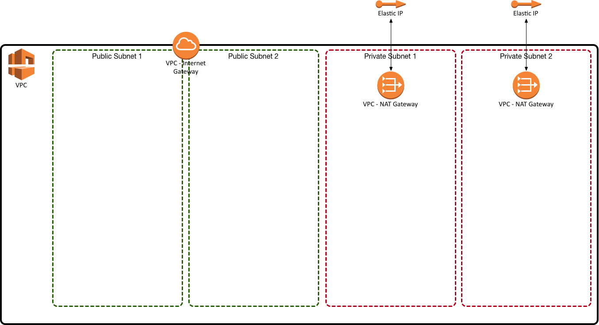

# terraform-vpc-sub

This spins up the following:

VPC

2 public subnets

2 private subnets

1 Internat Gateway used by public subnets

2 NAT Gateways used by private subnets

Route tables to make all this work

2 EIPs for NAT Gateways
